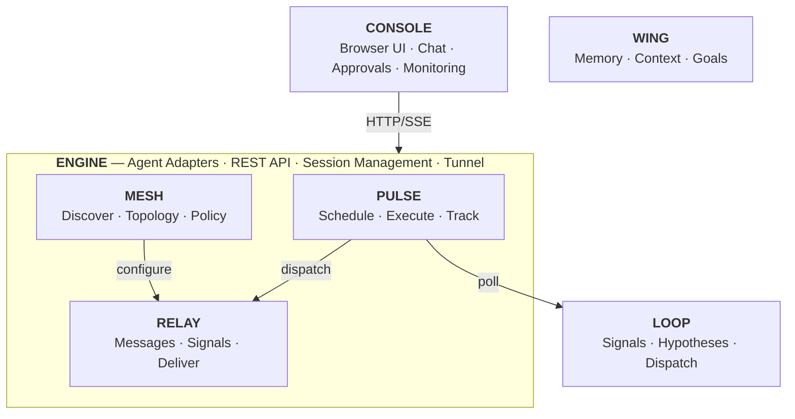

# DorkOS: The Operating System for Autonomous AI Agents

**By Dorian Collier**
**February 2026**

---

## The Problem

AI coding agents are powerful. Claude Code, Codex, OpenCode — they can write code, fix bugs, create pull requests, and refactor entire modules. In isolation, they're brilliant.

But they're also isolated.

A coding agent runs one session, does one thing, and forgets. It doesn't know what your other agents are doing. It doesn't remember what it shipped last week. It can't reach out to tell your team that a deploy succeeded. It can't wake up at 3am and execute your roadmap. It can't coordinate with the agent managing your finances to approve a budget before placing an order.

The gap isn't intelligence. Intelligence is what the models provide, and they're getting better every quarter. The gap is infrastructure.

Today's agents are like applications running without an operating system — each one manages its own memory, its own I/O, its own scheduling. Every session starts from scratch. There's no shared state. No communication layer. No heartbeat.

We solved this problem for applications fifty years ago. We called the solution an operating system.

---

## What DorkOS Is

DorkOS is an open-source operating system that makes AI coding agents more capable. It provides the infrastructure that agents need to be autonomous: scheduling, memory, communication, coordination, and a unified interface for humans to manage it all.

**DorkOS is not an agent.** It doesn't contain an AI model. It doesn't generate code. It doesn't make inferences.

**DorkOS is not an agent wrapper.** An application isn't a "database wrapper" because it uses PostgreSQL. A web server isn't a "network wrapper" because it uses TCP. DorkOS uses agents the same way — as the execution layer that provides intelligence. Everything else is DorkOS.

The analogy is precise: DorkOS is to AI agents what an operating system is to applications. Applications provide the computation. The OS provides scheduling, memory management, inter-process communication, I/O, and a user interface. Without an OS, each application has to reinvent all of that. With an OS, applications focus on what they're good at.

DorkOS gives agents:

- **A heartbeat** — scheduled execution that runs while you're asleep
- **A memory** — persistent context that survives across sessions
- **A voice** — a universal message bus for agents, humans, and external services
- **A network** — agent discovery, network topology, and access control
- **An interface** — a browser-based command center for human oversight

The intelligence comes from the agents. Everything else comes from DorkOS.

---

## Agent Adapters

DorkOS doesn't depend on any single AI agent. It uses a pluggable adapter architecture.

The first adapter supports Claude Code via Anthropic's Agent SDK. Claude Code is the most capable coding agent available today, and DorkOS makes full use of it — sessions, tool approvals, streaming, slash commands, all of it.

But Claude Code is the first supported agent, not the only one. The adapter pattern means adding support for a new agent requires implementing a defined interface: start a session, send messages, stream responses, handle tool approvals. The core DorkOS infrastructure — scheduling, communication, the mesh, the console — works with any agent that conforms to this interface.

Codex, OpenCode, and others are on the roadmap. The positioning is deliberate: bring your agent, we make it autonomous.

---

## The Architecture

DorkOS is a platform, a set of composable modules, and an extension ecosystem.

The **platform** — Engine and Console — is the foundation: a runtime for AI agents and a browser-based command center. The **modules** — Pulse, Relay, and Mesh — are independent packages that add scheduling, messaging, and agent networking. Each is a separate npm package, usable on its own or composed together. The **extensions** — Wing and Loop — integrate from outside to provide persistent memory and autonomous improvement.

### Engine — The Runtime

Engine is the foundation. It connects your AI agents via adapters, exposes a secure REST + SSE API, manages sessions, and composes the modules (Pulse, Relay, Mesh) into a unified server.

Engine runs locally on your machine. Sessions are stored as JSONL transcript files — the same format Claude Code uses natively. This means every session is visible regardless of how it was started: from DorkOS, from the CLI, from an Obsidian plugin. One source of truth.

Remote access is available via an optional ngrok tunnel. Engine can serve the Console UI and accept API calls from any device, anywhere.

- REST + SSE API with OpenAPI documentation
- JSONL transcripts as the single source of truth for session data
- Pluggable agent adapters (Claude Code via Agent SDK today)
- Optional tunnel for remote access
- Directory boundary enforcement for security
- MCP tool server for agent-accessible capabilities

**Status: Available**

### Console — The Interface

Console is a browser-based command center built with React 19, Tailwind CSS 4, and shadcn/ui. It's where humans interact with the system — chatting with agents, approving tool calls, browsing sessions, managing schedules, and monitoring the system.

Console connects to Engine via a Transport interface that decouples the UI from its backend. Two adapters exist: `HttpTransport` for standalone web use, and `DirectTransport` for embedded use in Obsidian. This means Console works as a standalone web app, as a plugin inside your knowledge management tool, or as a bundled CLI — same interface, different delivery mechanisms.

- Chat with agents in rich markdown with syntax highlighting
- Approve or deny every tool call before it executes
- Browse, resume, and sync sessions across devices
- Slash command palette for custom workflows
- Real-time session sync across multiple clients

**Status: Available**

### Pulse — The Scheduler

Pulse is the heartbeat. It executes work autonomously on a cron schedule — running roadmap items, triaging issues, soliciting feedback, and dispatching tasks to agents without human intervention.

Pulse uses `croner` with overrun protection to prevent concurrent execution of the same schedule. Each run creates an isolated agent session with full context about what needs to be done. Runs are tracked in a SQLite database with retention pruning.

When integrated with Loop (see below), Pulse polls for the next priority task and executes it with fully prepared instructions. This is how DorkOS achieves autonomous improvement — Pulse provides the execution cadence, Loop provides the intelligence about what to execute.

- Cron-based scheduling with overrun protection
- Isolated agent sessions per run
- Run history and retention management
- Configurable concurrency limits
- API for schedule CRUD and manual triggering

**Status: Available**

### Relay — The Universal Message Bus

Relay is kernel IPC for agents. It handles all messaging in DorkOS — agent-to-agent, human-to-agent, external-to-agent, and system dispatches. One message format, one delivery system, one audit trail.

Without Relay, agents are trapped inside your terminal. They can write code and create PRs, but they can't tell anyone about it and they can't coordinate with each other. Relay gives agents a voice and a network.

- Hierarchical subjects with NATS-style wildcards for point-to-point and pub/sub
- Two modes: persistent Messages (Maildir + SQLite) and ephemeral Signals (typing, presence, receipts)
- Budget envelopes that prevent runaway loops — hop counts, ancestor chains, TTL, call budgets
- Plugin adapter model for external channels (Telegram, Slack, email, webhooks)
- At-most-once delivery with dead letter queue for failed messages

See the [Relay Litepaper](./modules/relay-litepaper.md) for the full vision.

**Status: Available**

### Mesh — Agent Discovery and Network Topology

Mesh turns isolated agents into a discoverable, governed network.

The core idea: every project directory is a potential agent. Each has its own rules, hooks, skills, and memories. Mesh uses pluggable discovery strategies to find candidates — detecting `.claude/`, `.cursor/`, `.codex/`, or custom file patterns. But discovery is reconnaissance, not admission. A human or agent must review candidates and explicitly register them before they join the mesh.

Registration is the intentional act. When an agent is registered, Mesh writes a `.dork/agent.json` manifest to the project directory — the agent's portable identity card. It registers a Relay endpoint, configures access control rules, and adds the agent to the network. Agents that are denied won't resurface on subsequent scans.

A concrete example: your scheduling agent detects a birthday next week. It queries Mesh for a registered agent with budgeting capabilities. Mesh returns the finance agent's identity and Relay address. The scheduling agent sends a message through Relay. The finance agent approves $50, discovers the purchasing agent through Mesh, and routes the order through Relay. Four agents, four domains, one coordinated action — every agent there because someone chose to put it there.

- Pluggable discovery strategies (Claude Code, Cursor, Codex, custom patterns)
- Intentional registration workflow — approve, deny, or manually register agents
- `.dork/agent.json` manifest generated by Mesh at registration time
- Agent-agnostic: `.dork/` configuration works with any runtime, not just Claude Code
- Network topology with namespace isolation (default-allow within project, default-deny across)
- Access control rules authored by Mesh, enforced by Relay
- Three approval interfaces: Console UI, MCP tools (agent-driven), CLI

See the [Mesh Litepaper](./modules/mesh-litepaper.md) for the full vision.

**Status: Available**

### Wing — Life Layer (Extension)

Wing is the always-on AI companion. It provides persistent context about your goals, commitments, priorities, and life — making every agent interaction informed by who you are and what you're working toward.

Wing isn't just storage. It's presence. It remembers what matters, helps you plan, keeps you accountable, and surfaces relevant context when agents need it. When a coding agent asks "what should I prioritize?", Wing provides the answer from your actual goals and commitments, not from a stale project board.

- Persistent memory across all agent sessions
- Life coordination and commitment tracking
- Proactive context surfacing
- Journal and knowledge base

**Status: Coming Soon**

### Loop — The Improvement Layer (Extension)

Loop is a companion product by Dork Labs that extends DorkOS with autonomous improvement. It closes the feedback loop — collecting signals from the real world (analytics, error logs, user feedback), forming hypotheses, dispatching tasks to agents, and measuring outcomes.

Loop is a standalone product — a fully deterministic data system with zero AI built in. No LLM calls. No embeddings. No model dependencies. Loop stores human-authored instruction templates and, when an agent asks "what should I work on next?", returns the highest-priority unblocked item with detailed instructions.

DorkOS integrates with Loop through Pulse: on a scheduled cadence, Pulse polls Loop's dispatch endpoint, receives the next priority task, and executes it as an agent session. The agent reports results back to Loop. Outcomes feed in as new signals. The system improves itself.

See the [Loop Litepaper](../research/loop-litepaper.md) for the full vision.

**Status: [Live](https://www.looped.me/)**

---

## How the Pieces Interact

**A concrete workflow — autonomous roadmap execution:**

1. **Pulse** fires at 2am. It polls **Loop** for the next priority task.
2. **Loop** returns: "Implement dark mode toggle — hypothesis: users in dark environments have 15% higher bounce rate. Validation: bounce rate drops below 8% within 72 hours."
3. **Engine** creates an isolated agent session. The agent adapter connects to Claude Code.
4. **Wing** injects context: "The user prefers Tailwind CSS, uses shadcn/ui components, and the design system specifies `bg-neutral-950` as the dark background."
5. The agent writes the code, creates a PR, and writes tests.
6. **Relay** delivers a notification to `relay.human.slack.channel.deploys` via the Slack adapter: "Dark mode toggle shipped — PR #312 ready for review."
7. **Relay** routes an inter-agent message to the monitoring agent (discovered by **Mesh**) to watch bounce rate metrics for 72 hours.
8. 72 hours later, the monitoring agent reports results back to **Loop**. The hypothesis is validated (or not). The loop continues.

No human intervened. The system scheduled, executed, communicated, coordinated, and measured — autonomously.

---

## Design Principles

### Open Source (MIT)

All of DorkOS is MIT-licensed. The architecture, the modules, the adapters — everything. No open-core bait-and-switch. No premium tier that locks the real features.

### Honest by Design

DorkOS doesn't hide what it is. The agents use cloud APIs for inference. Your code context is sent to model providers. DorkOS doesn't change that and won't pretend it does. What DorkOS controls: the agent runs on your machine, sessions are stored locally, tools execute in your shell, and the orchestration layer is entirely yours.

### Autonomous by Default

DorkOS is built for agents that work without human intervention. Pulse doesn't wait for permission to execute. Relay doesn't ask before delivering messages. Mesh doesn't require approval to discover agents. The system is designed to be autonomous, with humans providing oversight and direction rather than micromanaging every action.

### Agent-Agnostic

Claude Code is the first supported agent. It won't be the last. The adapter architecture ensures DorkOS never depends on a single model provider or agent platform. Bring your agent. We make it autonomous.

### Developer-First

DorkOS installs via npm. Configures via JSON. Extends via slash commands and MCP tools. Debugs via JSONL transcripts. It's built by developers, for developers, with no concessions to users who don't know what a terminal is.

---

## What DorkOS Is NOT

**Not a hosted service.** DorkOS runs on your machine. There is no cloud deployment, no managed offering, no SaaS dashboard. You install it. You run it. You control it.

**Not a model provider.** DorkOS doesn't contain an AI model. It connects to agents that use models. The model costs are between you and your provider.

**Not a chatbot wrapper.** DorkOS is infrastructure. A chatbot wrapper puts a pretty face on an API call. DorkOS gives agents scheduling, memory, communication, coordination, and a management interface. These are fundamentally different things.

**Not an LLM.** DorkOS doesn't do inference. It doesn't have weights. It doesn't generate text. It orchestrates agents that do all of that.

**Not an agent wrapper.** The most common misconception. DorkOS doesn't just "wrap" Claude Code with a UI. It provides the infrastructure layer that makes agents autonomous — the same way an operating system provides the infrastructure layer that makes applications useful. Remove the OS, and applications can still compute. But they can't schedule, communicate, coordinate, or persist. That's what DorkOS provides.

---

## Changes from v1 → v2 (February 2026)

- **Relay**: Reframed from "outbound communication" to "universal message bus" — Relay now handles all messaging (agent↔agent, human↔agent, external↔agent), not just outbound notifications
- **Mesh**: Narrowed from "structured message passing + discovery" to "agent discovery + network topology + access control" — messaging responsibilities moved to Relay
- **Architecture diagram**: Relay shown as foundation layer beneath Mesh and Pulse (was shown as a peer)
- **Workflow example**: Updated to reflect Relay as transport for both external notifications and inter-agent messages
- **Module litepapers**: Added links to standalone [Relay](./modules/relay-litepaper.md) and [Mesh](./modules/mesh-litepaper.md) litepapers in `meta/modules/`
- **Architecture taxonomy**: Replaced flat "seven modules" with three-tier framing — platform (Engine, Console), composable modules (Pulse, Relay, Mesh as independent npm packages), and extensions (Wing, Loop)

---

## The Vision

The trajectory is clear. AI agents are becoming infrastructure — as fundamental as databases, message queues, and container orchestrators. Every company will run agents. Every developer will manage agents. The question is whether those agents will be isolated processes with no coordination, or a unified system with scheduling, memory, communication, and feedback loops.

DorkOS is the operating layer for that future.

Any agent. Any model. Your infrastructure. Your rules.

Your AI never sleeps.
